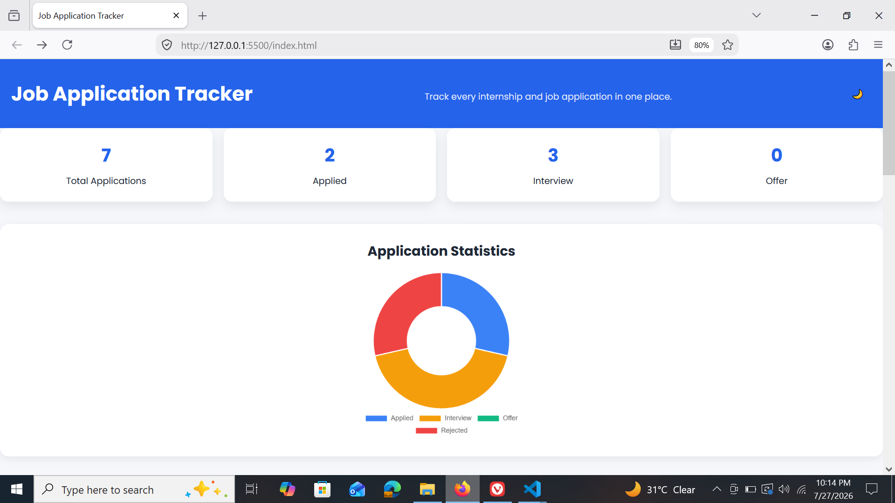
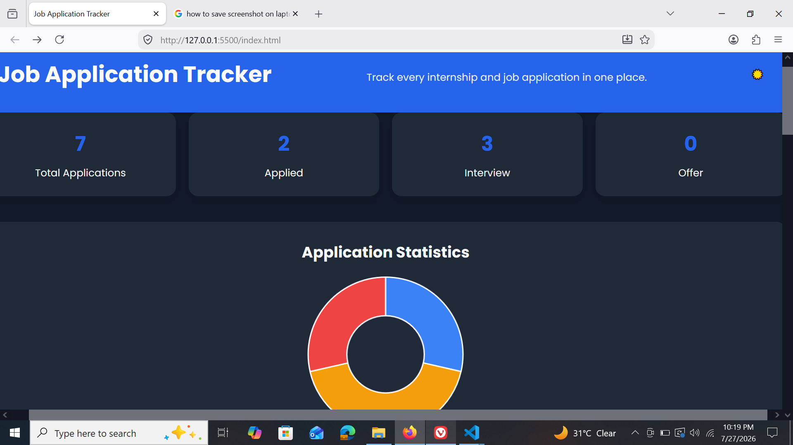

# 💼 Job Application Tracker

A modern, responsive **Full-Stack Job Application Tracker** that helps users manage and organize job applications efficiently. Built with **HTML, CSS, JavaScript, Node.js, and Express.js**, this application provides complete CRUD functionality with an intuitive dashboard, analytics, search, filtering, dark mode, and CSV export.

---

## 📸 Preview

> Add screenshots here after deployment.

| Dashboard | Dark Mode |
|-----------|-----------|
|  |  |

---

## 🚀 Live Demo

**Frontend:** Coming Soon

**Backend API:** Coming Soon

---

# ✨ Features

- 📋 Create, Read, Update & Delete Job Applications
- 🔍 Search applications by Company or Position
- 🎯 Filter applications by Status
- 📊 Dashboard Statistics
- 📈 Interactive Status Chart using Chart.js
- 📄 Export applications to CSV
- 🌙 Dark / Light Mode
- 👁 View Application Details in Modal
- 📱 Fully Responsive Design
- 🎨 Modern and Clean User Interface

---

# 🛠 Tech Stack

### Frontend
- HTML5
- CSS3
- JavaScript (ES6)
- Chart.js

### Backend
- Node.js
- Express.js

### Database
- JSON File Storage (File System)

---

# 📂 Project Structure

```text
Job-Application-Tracker
│
├── backend
│   ├── controllers
│   │   └── applicationController.js
│   │
│   ├── data
│   │   └── applications.json
│   │
│   ├── routes
│   │   └── applicationRoutes.js
│   │
│   ├── package.json
│   └── server.js
│
├── frontend
│   ├── index.html
│   ├── style.css
│   ├── script.js
│   ├── favicon.png
│   └── assets
│
└── README.md
```

---

# ⚙️ Installation

## 1️⃣ Clone the Repository

```bash
git clone https://github.com/SalmanFaisalx018/Job-Application-Tracker.git
```

```bash
cd Job-Application-Tracker
```

---

## 2️⃣ Install Backend Dependencies

```bash
cd backend
```

```bash
npm install
```

---

## 3️⃣ Start the Backend Server

```bash
npm run dev
```

Server will start on:

```
http://localhost:3000
```

---

## 4️⃣ Run the Frontend

Open the **frontend** folder and launch `index.html` using **Live Server** in VS Code.

---

# 🌐 REST API Endpoints

| Method | Endpoint | Description |
|---------|----------|-------------|
| GET | `/api/applications` | Get all applications |
| POST | `/api/applications` | Add a new application |
| PUT | `/api/applications/:id` | Update an application |
| DELETE | `/api/applications/:id` | Delete an application |

---

# 📊 Dashboard Features

### Dashboard Statistics

- Total Applications
- Applied
- Interview
- Offer

---

### Search

Search applications by:

- Company Name
- Position

---

### Filter

Filter applications based on:

- All
- Applied
- Interview
- Offer
- Rejected

---

### Analytics

Interactive status visualization using **Chart.js**.

---

### CSV Export

Export all application records into a CSV file.

---

### Dark Mode

Switch seamlessly between Light and Dark themes.

---

### Responsive Design

Optimized for:

- 💻 Desktop
- 📱 Mobile
- 📟 Tablet

---

<h2>📸 Screenshots</h2>

<p align="center">
  
  
</p>

<p align="center">
  
  
</p>

### Dashboard

```

```

### Add Application

```

```

### Statistics

```

```

### Dark Mode

```

```

### Mobile View

```

```

---

# 🎯 Future Improvements

- User Authentication
- Database Integration (MongoDB)
- Email Notifications
- Application Deadline Tracking
- Notes & Attachments
- Sorting by Date or Salary
- Pagination
- Company Logos
- Interview Scheduler

---

# 🧠 Key Concepts Learned

- REST APIs
- CRUD Operations
- MVC Architecture
- Express.js Routing
- File System (JSON Database)
- DOM Manipulation
- Async/Await
- Fetch API
- Responsive Web Design
- CSS Grid & Flexbox
- Chart.js Integration
- Dark Mode Implementation
- CSV File Export

---

# 👨‍💻 Author

**Salman Faisal**

BS Information Technology Student

Passionate about Full-Stack Web Development and Software Engineering.

GitHub: https://github.com/SalmanFaisalx018

LinkedIn: (https://www.linkedin.com/in/salman-faisal-321a15321/)

---

# ⭐ Support

If you found this project helpful, consider giving it a **⭐ Star** on GitHub.

---

# 📄 License

This project is licensed under the **MIT License**.

Feel free to use, modify, and distribute it for learning and personal projects.