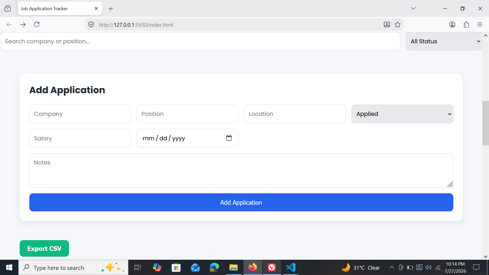
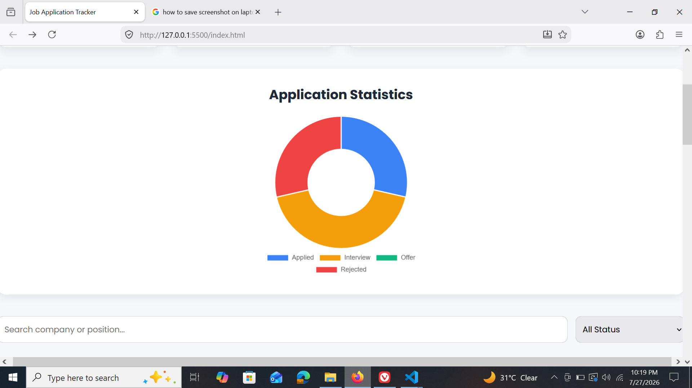
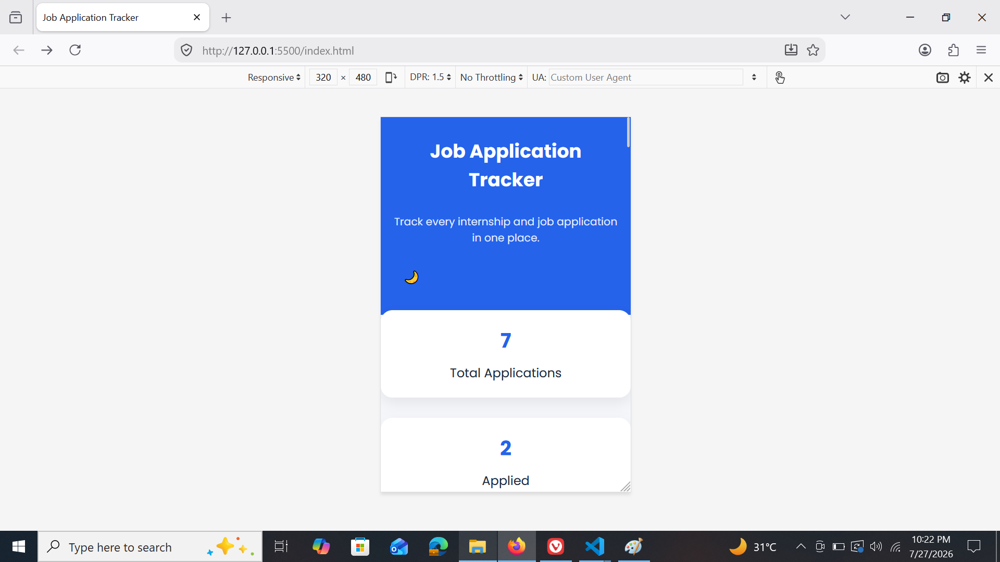

# 💼 Job Application Tracker

A modern, responsive **Full-Stack Job Application Tracker** that helps users securely manage and organize their job applications. Built with **HTML, CSS, JavaScript, Node.js, Express.js, and JWT Authentication**, the application provides user registration, secure login, CRUD operations, analytics, search, filtering, dark mode, CSV export, and a responsive user experience.

---


---
## 📸 Preview

| Dashboard | Dark Mode |
|-----------|-----------|
|  |  |

---
## 🚀 Live Demo

**Frontend:** (https://job-application-tracker-sand-nine.vercel.app)

**Backend API:** (https://jobapplication-tracker-production.up.railway.app)

---

# ✨ Features

- 🔐 User Authentication (Signup & Login)
- 🛡 Secure JWT-based Authentication
- 📋 Create, Read, Update & Delete Job Applications
- 🔍 Search Applications by Company or Position
- 🎯 Filter Applications by Status
- 📊 Dashboard Statistics
- 📈 Interactive Status Chart using Chart.js
- 📄 Export Applications to CSV
- 🌙 Dark / Light Mode
- 👁 View Application Details in Modal
- 🚪 Secure Logout
- 📱 Fully Responsive Design
- 🎨 Modern & Professional User Interface
---

# 🛠 Tech Stack

### Frontend
- HTML5
- CSS3
- JavaScript (ES6)
- Chart.js

### Backend
- Node.js
- Express.js

### Authentication
- JSON Web Token (JWT)
- bcrypt.js

### Database
- JSON File Storage (File System)

### Deployment
- Vercel (Frontend)
- Railway (Backend)
---

# 📂 Project Structure

```text
Job-Application-Tracker
│
├── assets
│   ├── dashboard.png
│   ├── add-application.png
│   ├── chart.png
│   ├── dark-mode.png
│   ├── mobile.png
│   └── statistics.png
│
├── backend
│   ├── controllers
│   │   ├── applicationController.js
│   │   └── authController.js
│   │
│   ├── middleware
│   │   └── authMiddleware.js
│   │
│   ├── routes
│   │   ├── applicationRoutes.js
│   │   └── authRoutes.js
│   │
│   ├── data
│   │   ├── applications.json
│   │   └── users.json
│   │
│   ├── package.json
│   ├── package-lock.json
│   └── server.js
│
├── frontend
│   ├── index.html
│   ├── login.html
│   ├── signup.html
│   ├── auth.css
│   ├── auth.js
│   ├── style.css
│   ├── script.js
│   ├── login.svg
│   └── favicon.png
│
├── .env.example
├── .gitignore
├── LICENSE
└── README.md
```

---

# ⚙️ Installation

## 1️⃣ Clone the Repository

```bash
git clone https://github.com/SalmanFaisalx018/Job-Application-Tracker.git
```

```bash
cd Job-Application-Tracker
```

---

## 2️⃣ Install Backend Dependencies

```bash
cd backend
```

```bash
npm install

```
## 3️⃣ Configure Environment Variables

Create a `.env` file inside the **backend** folder.

```env
PORT=3000
JWT_SECRET=your_secret_key_here
```

---

## 4️⃣ Start the Backend Server

```bash
npm run dev
```

Server runs at:

```
http://localhost:3000
```

---

## 5️⃣ Run the Frontend

Open the **frontend** folder and launch:

```
login.html
```

using **Live Server** in VS Code.

---

# 🌐 REST API Endpoints

| Method | Endpoint                | Description           |
| ------ | ----------------------- | --------------------- |
| POST   | `/api/auth/signup`      | Register a new user   |
| POST   | `/api/auth/login`       | Login and receive JWT |
| GET    | `/api/applications`     | Get all applications  |
| POST   | `/api/applications`     | Create application    |
| PUT    | `/api/applications/:id` | Update application    |
| DELETE | `/api/applications/:id` | Delete application    |


---

# 📊 Dashboard Features

### Dashboard Statistics

- Total Applications
- Applied
- Interview
- Offer

---

### Search

Search applications by:

- Company Name
- Position

---

### Filter

Filter applications based on:

- All
- Applied
- Interview
- Offer
- Rejected

---

### Analytics

Interactive status visualization using **Chart.js**.

---

### CSV Export

Export all application records into a CSV file.

---

### Dark Mode

Switch seamlessly between Light and Dark themes.

---

### Responsive Design

Optimized for:

- 💻 Desktop
- 📱 Mobile
- 📟 Tablet

---

<h2>📸 Screenshots</h2>
<p align="center">
  
</p>

<p align="center">
  
  
</p>

<p align="center">
  
  
</p>


---

## ➕ Add Application


---


## 📈 Analytics Chart


---

## 🌙 Dark Mode


---

## 📱 Mobile View


# 🎯 Future Improvements

- Password Reset
- Email Verification
- MongoDB Integration
- User Profile Management
- Protected API Routes
- Application Deadline Reminders
- Interview Scheduler
- Company Logos
- Notes & Attachments
- Pagination
- Sorting & Advanced Filters

---

# 🧠 Key Concepts Learned

- REST APIs
- CRUD Operations
- MVC Architecture
- Express.js Routing
- Authentication & Authorization
- JWT (JSON Web Tokens)
- Password Hashing with bcrypt.js
- Environment Variables (.env)
- File System (JSON Database)
- Async/Await
- Fetch API
- DOM Manipulation
- Chart.js Integration
- Responsive Web Design
- CSS Grid & Flexbox
- Dark Mode Implementation
- CSV Export
---

# 👨‍💻 Author

**Salman Faisal**

BS Information Technology Student

Passionate about Full-Stack Web Development and Software Engineering.

GitHub: https://github.com/SalmanFaisalx018

LinkedIn: (https://www.linkedin.com/in/salman-faisal-321a15321/)

---

# ⭐ Support

If you found this project helpful, consider giving it a **⭐ Star** on GitHub.

---

# 📄 License

This project is licensed under the **MIT License**.

Feel free to use, modify, and distribute it for learning and personal projects.